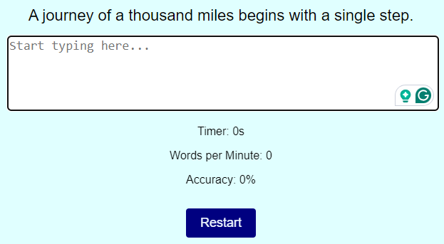

<h1 align="center">Typing Speed Test</h1>

[View the live project here.](https://alessandro-bf.github.io/typing-speed-project2/)

The Typing Speed Test is a web-based application designed to help users assess and improve their typing speed and accuracy. This simple tool is useful for individuals looking to enhance their keyboarding skills, which is especially beneficial for professionals such as developers, writers, and anyone else who relies heavily on typing.


<h2 align="center"></h2>

## Features

1. Dynamic Text:
    - Each test is initiated with a randomly selected sentence that the user must type, enhancing the challenge and variety of the test.
1. Real-Time Feedback:
    - The application provides real-time updates on the user's typing speed (words per minute), accuracy (percentage), and elapsed time (seconds).
1. Immediate Restart:
    - Users can restart the test at any time by pressing the "Restart" button or the "Enter" key, allowing for continuous practice.
1. Visual Highlights:
    - Typed text is visually compared to the provided text, with correct and incorrect characters highlighted accordingly.


## How to Use?

### Starting the Test

-   Open the application in a web browser.
-   The test starts automatically when the page is loaded.
-   Begin typing the displayed sentence in the text area.

<h2 align="center"></h2>

### During the Test

-   As you type, the application tracks and displays your typing speed, accuracy, and the time elapsed since the start of the test.
-   Your input is highlighted in real-time to show correct (green) and incorrect (red) entries.

<h2 align="center"></h2>

### Restarting the Test

-   Click the "Restart" button or press the "Enter" key to start over with a new sentence.

<h2 align="center"></h2>


## Technologies Used

### Languages Used

1. HTML:
    - Structures the content and layout of the application.
    -   [HTML5](https://en.wikipedia.org/wiki/HTML5)
1. CSS:
    - Styles the visual appearance of the application.
    -   [CSS3](https://en.wikipedia.org/wiki/Cascading_Style_Sheets)
1. JavaScript:
    - Powers the interactive elements of the application, including the test logic and UI updates.
    -   [JavaScript](https://en.wikipedia.org/wiki/JavaScript)

### Frameworks, Libraries & Programs Used

1. [Git](https://www.gitpod.io/)
    - Git was used for version control by utilizing the Gitpod terminal to commit to Git and Push to GitHub.
1. [GitHub:](https://github.com/)
    - GitHub is used to store the projects code after being pushed from Git.


## Testing

The W3C Markup Validator and W3C CSS Validator Services were used to validate every page of the project to ensure there were no syntax errors in the project.

-   HTML: No errors were returned when passing through the official - [W3C Markup Validator](https://validator.w3.org/#validate_by_input)
-   CSS: No errors were returned when passing through the official - [W3C CSS Validator](https://jigsaw.w3.org/css-validator/#validate_by_input)
-   JavaScript: No errors were returned when passing through the official - [JavaScript Validator](https://jshint.com/)
    -   The following metrics were returned:
    -   There are 9 functions in this file.
    -   Function with the largest signature take 2 arguments, while the median is 1.
    -   Largest function has 10 statements in it, while the median is 3.
    -   The most complex function has a cyclomatic complexity value of 3 while the median is 1.

### Further Testing

-   The Website was tested on Google Chrome, Internet Explorer, Microsoft Edge and Safari browsers.
-   The website was viewed on a variety of devices such as Desktop, Laptop, iPhone7, iPhone 8 & iPhoneX.
-   Friends and family members were asked to review the site and documentation to point out any bugs and/or user experience issues.
-   A Lighthouse test was performed using the DevTool with the following results:

<h2 align="center"></h2>

### Known Bugs

-   During the testing, the JavaScript Validator showed an error when using let instead of const to declare variables.
    -   It is a bug from the validator - [Answer to the JavaScript validator mistake](https://stackoverflow.com/questions/27441803/why-does-jshint-throw-a-warning-if-i-am-using-const)
-   The statistics function didn't work, and the data was showing 0 all the time.
    -   A typing mistake on an instruction was found.
    -   The functions were not in the correct order.

## Deployment

### GitHub Pages

The project was deployed to GitHub Pages using the following steps...

1. Log in to GitHub and locate the [GitHub Repository](https://github.com/Alessandro-bf/typing-speed-project2.git)
2. At the top of the Repository (not top of page), locate the "Settings" Button on the menu.
3. Scroll down the Settings page until you locate the "GitHub Pages" Section.
4. Under "Source", click the dropdown called "None" and select "Main Branch".
5. The page will automatically refresh.
6. Scroll back down through the page to locate the now published site [link](https://alessandro-bf.github.io/typing-speed-project2/) in the "GitHub Pages" section.

### Forking the GitHub Repository

By forking the GitHub Repository we make a copy of the original repository on our GitHub account to view and/or make changes without affecting the original repository by using the following steps...

1. Log in to GitHub and locate the [GitHub Repository](https://github.com/Alessandro-bf/typing-speed-project2.git)
2. At the top of the Repository (not top of page) just above the "Settings" Button on the menu, locate the "Fork" Button.
3. You should now have a copy of the original repository in your GitHub account.

### Making a Local Clone

1. Log in to GitHub and locate the [GitHub Repository](https://github.com/Alessandro-bf/typing-speed-project2.git)
2. Under the repository name, click "Clone or download".
3. To clone the repository using HTTPS, under "Clone with HTTPS", copy the link.
4. Open Git Bash
5. Change the current working directory to the location where you want the cloned directory to be made.
6. Type `git clone`, and then paste the URL you copied in Step 3.

```
$ git clone https://github.com/YOUR-USERNAME/YOUR-REPOSITORY
```

7. Press Enter. Your local clone will be created.

```
$ git clone https://github.com/YOUR-USERNAME/YOUR-REPOSITORY
> Cloning into `CI-Clone`...
> remote: Counting objects: 10, done.
> remote: Compressing objects: 100% (8/8), done.
> remove: Total 10 (delta 1), reused 10 (delta 1)
> Unpacking objects: 100% (10/10), done.
```

## Credits

### Code

-   The code for the application was built using the Love Running and the Love Maths projects from the Full Stack Developer Course of Code Institute lessons.

-   The ReadMe.md document was produced using a model Code Institute template provided by my Mentor.

### Content

-   The website's developer used google search to find famous phrases to type in as a test.

### Media

-   The background image was downloaded from (https://wallpaperaccess.com/blue-technology)

### Acknowledgements

-   My Mentor for continuous helpful feedback.

-   Tutor support at Code Institute for their support.

-   Internet Tutorials: [codewithcurious](https://codewithcurious.com/projects/typing-speed-test-game-in-html-css-js/) and [endyourif](https://www.endyourif.com/building-a-typing-speed-test-program-with-javascript/).